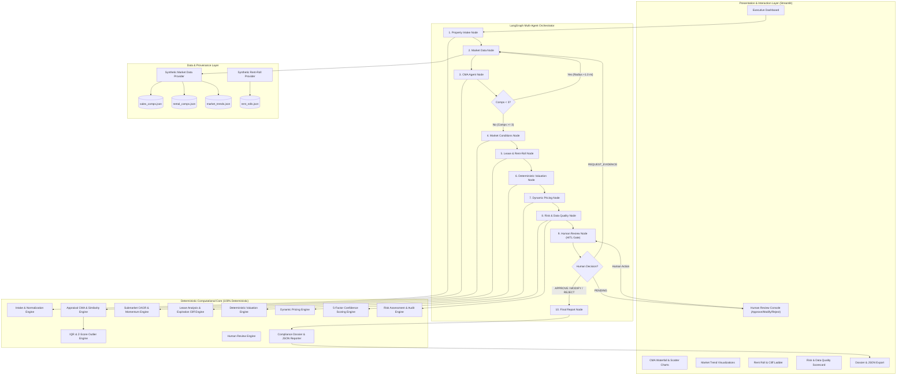
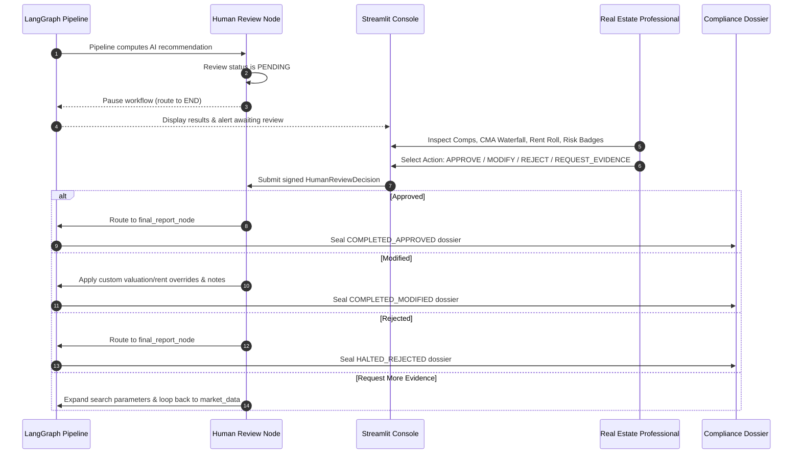

# System Architecture: Automated Valuation & Dynamic Pricing Agent

## 1. Executive System Overview

The **Automated Valuation & Dynamic Pricing Agent** is an institutional-grade, multi-agent AI decision-support platform designed to assist real estate asset managers, appraisers, and investment committees in estimating property market valuations and formulating dynamic rental pricing strategies.

### Critical Operational & Architectural Principles
1. **Decision-Support Classification:** The system is strictly a decision-support tool. It does **NOT** make or finalize legally consequential or binding real estate appraisals autonomously.
2. **Mandatory Human-in-the-Loop (HITL) Review Gate:** Every valuation and pricing recommendation requires explicit review, attestation, and signature by a qualified human professional before finalization.
3. **Deterministic Core Calculation Boundaries:** All financial calculations, valuation formulas, rental pricing bands, CMA feature adjustments, confidence scores, and risk evaluations are computed **100% deterministically** in Python outside the LLM. The LLM is never permitted to fabricate, estimate, or hallucinate financial numbers.
4. **Data Provenance & Non-Fabrication Guarantee:** Every record carries an explicit provenance tag (`SYNTHETIC DEMONSTRATION DATA`, `VERIFIED MARKET DATA`, or `USER-PROVIDED PROPERTY DATA`). Demonstration fixtures carry the mandatory notice: `"Synthetic demonstration data — not real market data."`
5. **Strict Tenant PII Safeguards:** Operational rent rolls are scrubbed of all Personally Identifiable Information (PII). Tenant identities are converted to pseudonymized cryptographic tokens (`TENANT-XXXX`).
6. **Immutable Multi-Agent Audit Trail:** Every agent action, input summary, output summary, execution latency, and warning is logged into an immutable audit trace.

---

## 2. High-Level System Architecture



---

## 3. LangGraph Workflow Topology & Agent Responsibilities

The workflow is modeled as a stateful directed acyclic graph (with controlled cyclic loops for evidence acquisition) using `langgraph.graph.StateGraph` typed over `AgentWorkflowState`.

### Node Inventory & Roles

| Node Name | Agent Role | Functionality | Primary Sources Consulted |
| :--- | :--- | :--- | :--- |
| `property_intake_node` | Property Intake Agent | Validates, sanitizes, and normalizes raw property inputs into a strongly typed `PropertyProfile`. | User Input Form / Demo Presets |
| `market_data_node` | Market Data Agent | Queries sales comps, rental comps, and submarket trend records within the active search radius. | `BaseMarketDataProvider` |
| `cma_node` | CMA Agent | Evaluates multi-attribute similarity, calculates step-by-step appraisal feature adjustments, detects outliers, and selects top comps. | `ComparableEngine` |
| `market_conditions_node` | Market Conditions Agent | Computes 24-month sales and rental CAGR, 6-month momentum, gross capitalization yields, and absorption velocity. | `MarketConditionsEngine` |
| `lease_rentroll_node` | Lease & Rent-Roll Agent | Analyzes unit-level rent rolls, computes occupancy/vacancy rates, and constructs the 30/60/90-day lease expiration cliff ladder. | `LeaseAnalysisEngine` |
| `valuation_node` | Valuation Agent | Executes multi-component deterministic valuation (CMA + Trend + Location + Income Capitalization) and range bounds. | `DeterministicValuationEngine` |
| `dynamic_pricing_node` | Dynamic Pricing Agent | Formulates optimal rental pricing band `[Floor, Midpoint, Ceiling]` and in-place rent gap analysis. | `DynamicPricingEngine` |
| `risk_quality_node` | Risk & Data Quality Agent | Evaluates 8 risk categories, computes 0–100 composite data quality score, and sets overall risk severity. | `RiskQualityEngine`, `ScoringEngine` |
| `human_review_node` | Human Review Agent | Enforces mandatory Human-in-the-Loop review gate. Pauses workflow when pending; records reviewer overrides and justification notes. | `HumanReviewEngine` |
| `final_report_node` | Final Report Agent | Finalizes workflow state, seals audit log, and prepares compliance dossier metadata. | `ComplianceDossierReporter` |

---

## 4. Conditional Routing & Safety Guardrails

### 1. CMA Auto-Expansion Routing (`route_after_cma`)
When the CMA engine identifies fewer than 3 qualifying comparable properties within the current search radius:
- If `search_radius_miles <= 4.5` miles: Increments radius by `+1.0` mile and routes backward to `market_data_node` for re-querying.
- If `search_radius_miles > 4.5` miles: Issues a high-severity risk flag (`INSUFFICIENT_COMPS`) and proceeds forward to avoid infinite search loops.

### 2. Human Review Gate Routing (`route_after_human_review`)
When the pipeline reaches the Human Review stage:
- **`ReviewStatus.PENDING` or `None`:** The conditional edge routes to `end_wait_for_human` (`langgraph.graph.END`), pausing execution.
- **`ReviewStatus.APPROVED` or `ReviewStatus.MODIFIED`:** Routes to `final_report_node` for completion.
- **`ReviewStatus.REJECTED`:** Routes to `final_report_node`, marking workflow status as `HALTED_REJECTED`.
- **`ReviewStatus.EVIDENCE_REQUESTED`:** Expands search radius by `+1.0` mile, increments evidence request count, and routes back to `market_data_node`.

### 3. Step Budget Guardrail
To mathematically guarantee termination and eliminate runaway recursion:
- Every agent node execution increments `state["step_count"]`.
- Enforces hard limit `max_steps = 15` and `max_evidence_requests = 3`.
- If step count reaches limit, routing halts immediately and terminates via `final_report_node` with status `HALTED_STEP_BUDGET_EXHAUSTED`.

---

## 5. State Lifecycle & Data Flow

The shared state dictionary (`AgentWorkflowState`) is passed across all nodes:

```python
class AgentWorkflowState(TypedDict, total=False):
    property_input: Dict[str, Any]
    property_profile: Optional[PropertyProfile]
    sales_records: List[MarketRecord]
    rental_records: List[MarketRecord]
    search_radius_miles: float
    comparables: List[ComparableProperty]
    cma_analysis: Optional[CMAAnalysis]
    market_conditions: Optional[MarketConditions]
    rent_roll_units: List[RentRollUnit]
    rent_roll_summary: Optional[RentRollSummary]
    valuation: Optional[ValuationResult]
    rental_pricing: Optional[RentalPricingResult]
    risk_report: Optional[RiskReport]
    human_review: Optional[HumanReviewDecision]
    audit_trail: List[AuditEntry]
    step_count: int
    max_steps: int
    workflow_status: str
    requires_more_evidence: bool
    evidence_request_count: int
    error_message: Optional[str]
```

### State Progression Flow
```
INITIALIZED 
  -> INTAKE_PROCESSED 
  -> MARKET_DATA_RETRIEVED 
  -> CMA_EVALUATED (optional: RADIUS_EXPANDED -> re-query)
  -> SUBMARKET_TRENDS_ANALYZED 
  -> RENT_ROLL_ANALYZED 
  -> VALUATION_COMPUTED 
  -> DYNAMIC_PRICING_COMPUTED 
  -> RISK_QUALITY_SCORED 
  -> WAITING_FOR_HUMAN_REVIEW (Execution paused)
  -> [Human Interaction via UI]
  -> COMPLETED_APPROVED | COMPLETED_MODIFIED | HALTED_REJECTED
```

---

## 6. Human-in-the-Loop (HITL) Review Architecture

Under platform governance rules, the AI cannot finalize legally binding appraisals or publish commercial rents autonomously.



---

## 7. Data Provenance & Synthetic Data Architecture

To prevent fabricated claims and ensure auditable integrity, every record in the platform carries strongly typed `ProvenanceMetadata`:

```python
class ProvenanceMetadata(BaseModel):
    source: str
    origin: DataOrigin  # SYNTHETIC_DEMONSTRATION_DATA, VERIFIED_MARKET_DATA, etc.
    notice: str
    retrieved_at: datetime
    record_id: Optional[str]
```

### Origin Classification System
- `SYNTHETIC DEMONSTRATION DATA`: Mathematically calibrated demonstration fixtures (`src/data/fixtures/`).
- `USER-PROVIDED PROPERTY DATA`: Subject asset specifications submitted via intake forms.
- `VERIFIED MARKET DATA`: Official records from county recorders or licensed MLS adapters.
- `MODEL PREDICTIONS`: Deterministic mathematical model outputs.
- `AGENT INTERPRETATIONS`: Qualitative forward commentary explicitly labeled as opinions, not historical facts.

---

## 8. Presentation & Reporting Architecture

### Streamlit Executive Analytics Dashboard (`src/ui/`)
- Pure presentation and human interaction layer.
- Strictly consumes `AgentWorkflowState` from the LangGraph supervisor.
- Institutional dark slate theme (`#0b0f19` canvas, `#1e293b` cards).
- 8 Dedicated tabs:
  1. `📊 Executive Summary`: Valuation cards, price range, confidence pill, dynamic rent band.
  2. `🏘️ Comparables (CMA)`: Comps scatter plot and similarity breakdown cards.
  3. `📈 Market Trends`: 24-month dual-axis PSF trend chart and momentum badges.
  4. `🏢 Lease & Rent Roll`: Physical vs economic occupancy gauges and 30/60/90-day cliff ladder.
  5. `⚠️ Risk & Data Quality`: Categorized audit flags with severity codes.
  6. `🧑‍⚖️ Human Review Console`: Interactive approval, modification, and rejection controls.
  7. `📜 Agent Audit Trace`: Chronological multi-agent execution log with millisecond latencies.
  8. `📥 Dossier & Export`: One-click Markdown and structured JSON compliance dossier downloads.

### Compliance Reporting Engine (`src/reporting/reporter.py`)
- Produces institutional Markdown (`.md`) investment committee dossiers.
- Produces complete, machine-readable JSON (`.json`) payloads for downstream enterprise software.
- Both export formats are generated 100% deterministically from current workflow state.
