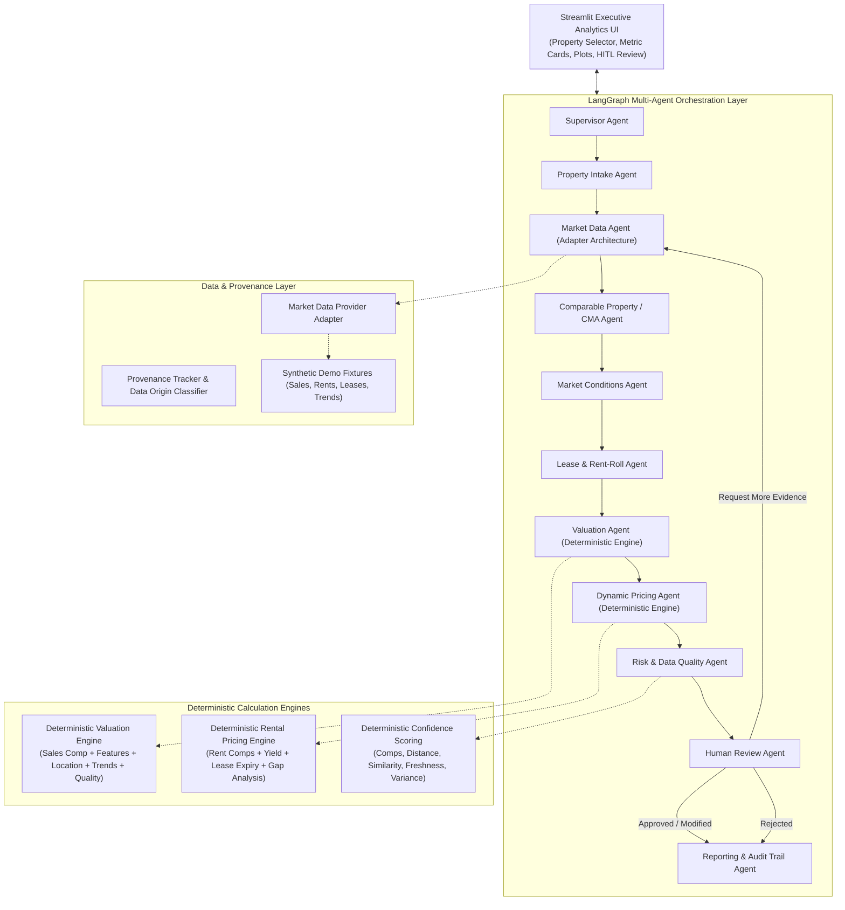

# Automated Valuation & Dynamic Pricing Agent - Implementation Plan

## Problem & Background

Real-estate professionals, asset managers, and property operators require reliable, explainable property valuation and rental pricing recommendations. Black-box estimates and autonomous, unverified pricing decisions create severe regulatory, legal, and financial risks. 

This platform builds an autonomous multi-agent decision-support architecture using **LangGraph**, a **deterministic mathematical valuation/pricing engine**, **strict provenance tracking**, and an **enforced Human-in-the-Loop (HITL) review stage**.

> [!IMPORTANT]
> **Decision-Support Guardrail**: This platform is explicitly a decision-support tool. It does not produce legally consequential or binding appraisals. No recommendation can be finalized or published without human approval.
> **Data Integrity Guardrail**: No market numbers are fabricated. All demo fixtures are explicitly tagged with `"Synthetic demonstration data — not real market data"` with clear provenance classification (Verified Market Data, User-Provided Data, Synthetic Demonstration Data, Model Predictions, Agent Interpretations).

---

## User Review Required

> [!IMPORTANT]
> Please review the proposed multi-agent workflow, deterministic formula structure, and phased delivery plan. Upon your approval, we will proceed phase-by-phase with verification at every step.

---

## Architecture Overview



---

## Proposed Changes & Phased Execution

We will implement the system following 10 structured, verifiable phases:

---

### PHASE 1: Architecture, Core Domain Models & State Machine
Establish the project foundation with strong Pydantic v2 schemas and TypedDict state models.

#### [NEW] [enums.py](file:///c:/Users/Venkat/Desktop/Sat%20Datta%20Projects/DynamicPricingAgent/src/core/enums.py)
- `PropertyType` (SingleFamily, Condo, MultiFamily, Townhouse, Commercial)
- `PropertyCondition` (Excellent, Good, Fair, Poor, Renovated)
- `DataOrigin` (`VERIFIED_MARKET_DATA`, `USER_PROVIDED_DATA`, `SYNTHETIC_DEMONSTRATION_DATA`, `MODEL_PREDICTIONS`, `AGENT_INTERPRETATIONS`)
- `ConfidenceLevel` (HIGH, MEDIUM, LOW)
- `ReviewStatus` (PENDING, APPROVED, MODIFIED, REJECTED, EVIDENCE_REQUESTED)
- `RiskSeverity` (LOW, MEDIUM, HIGH, CRITICAL)

#### [NEW] [models.py](file:///c:/Users/Venkat/Desktop/Sat%20Datta%20Projects/DynamicPricingAgent/src/core/models.py)
- `PropertyProfile`: Address, coordinates, sqft, beds, baths, year_built, lot_size, condition, amenities, current_rent, occupancy.
- `MarketRecord`: Record ID, date, sale/rent price, sqft, price_psf, distance_miles, data_origin, source, provenance metadata.
- `ComparableProperty`: MarketRecord + similarity_score, adjustments (size, age, condition, amenities), adjusted_price, selection_rationale.
- `CMAAnalysis`: Comparables list, price distribution, median/mean PSF, outlier records, adjustment matrix.
- `MarketConditions`: Historical PSF trend, annual growth rate, rental yield trend, inventory/supply indicator, fact vs interpretation flag.
- `RentRollUnit`: Unit ID, bed/bath, sqft, current_rent, lease_start, lease_end, status (Occupied, Vacant), tenant_pseudonym (no PII).
- `RentRollSummary`: Total units, occupied units, occupancy_rate, gross_rent, avg_rent_psf, lease_expiry_exposure.
- `ValuationResult`: Estimated value, range (low, high), valuation_psf, confidence, breakdown by component, methodology, legal disclaimer.
- `RentalPricingResult`: Current rent, estimated market rent, recommended range, recommended midpoint, rent gap, confidence, drivers.
- `RiskReport`: Identified risks, data quality score, warnings, conflicting data flags, outlier flags.
- `HumanReviewDecision`: Reviewer name, action (approve/modify/reject/request_evidence), modified_value, modified_rent, reviewer_notes, timestamp.
- `AuditEntry`: Step, agent_name, action, inputs_summary, outputs_summary, sources_consulted, execution_time_ms, timestamp.

#### [NEW] [state.py](file:///c:/Users/Venkat/Desktop/Sat%20Datta%20Projects/DynamicPricingAgent/src/core/state.py)
- `AgentWorkflowState` (TypedDict for LangGraph):
  - Subject property, raw input, market comps, CMA, market conditions, rent roll, valuation, rental pricing, risk report, human decision, audit trail, step counter, errors/warnings.

---

### PHASE 2: Market & Comparable Data Layer (Provider Adapter & Synthetic Fixtures)
Build the data abstraction layer with zero reliance on paid external APIs, using structured synthetic fixtures with clear provenance.

#### [NEW] [base.py](file:///c:/Users/Venkat/Desktop/Sat%20Datta%20Projects/DynamicPricingAgent/src/data/providers/base.py)
- Abstract `BaseMarketDataProvider` and `BaseRentRollProvider` interfaces for future pluggability (MLS, ATTOM, CoStar, RealPage).

#### [NEW] [synthetic_provider.py](file:///c:/Users/Venkat/Desktop/Sat%20Datta%20Projects/DynamicPricingAgent/src/data/providers/synthetic_provider.py)
- In-memory/JSON/SQLite provider returning labeled synthetic records.
- Guarantees every record contains:
  ```python
  provenance = ProvenanceMetadata(
      source="Synthetic Demonstration Provider v1.0",
      origin=DataOrigin.SYNTHETIC_DEMONSTRATION_DATA,
      notice="Synthetic demonstration data — not real market data.",
      retrieved_at=datetime.utcnow(),
  )
  ```

#### [NEW] [fixtures](file:///c:/Users/Venkat/Desktop/Sat%20Datta%20Projects/DynamicPricingAgent/src/data/fixtures/)
- `sales_comps.json`: 30+ geographically and typologically diverse sales records (Austin, TX; Seattle, WA; Miami, FL demo submarkets).
- `rental_comps.json`: 30+ rental market records with monthly rent, lease terms, amenities.
- `rent_rolls.json`: Realistic unit-level rent rolls for multi-family / rental properties.
- `market_trends.json`: 24-month historical sales PSF, rental PSF, and cap rates by submarket.

---

### PHASE 3: Property Intake & Comparable Selection / CMA Engine
Implement the core CMA intelligence: vector/attribute similarity scoring, feature-based price adjustments, and outlier detection.

#### [NEW] [comparable_engine.py](file:///c:/Users/Venkat/Desktop/Sat%20Datta%20Projects/DynamicPricingAgent/src/core/comparable_engine.py)
- **Multi-Attribute Similarity Scoring**:
  $$\text{Similarity} = w_d \cdot S_{\text{dist}} + w_s \cdot S_{\text{sqft}} + w_b \cdot S_{\text{beds}} + w_a \cdot S_{\text{age}} + w_c \cdot S_{\text{cond}}$$
- **CMA Feature Adjustment Engine**:
  - Size adjustment ($\pm \$ / \text{sqft}$)
  - Bedroom/bathroom count adjustments
  - Age / effective year built adjustments
  - Condition & amenities adjustments
  - Adjusted Price = $\text{Sale Price} + \sum \text{Adjustments}$
- **Outlier Detection**: Interquartile Range (IQR) and Z-score on price-per-square-foot.

---

### PHASE 4: Lease & Rent-Roll Analysis + Market Conditions
Extract actionable financial metrics from property operations and macro submarket trends.

#### [NEW] [lease_engine.py](file:///c:/Users/Venkat/Desktop/Sat%20Datta%20Projects/DynamicPricingAgent/src/core/lease_engine.py)
- Calculate occupancy rate, physical vs economic vacancy.
- Compute weighted average in-place rent per sqft.
- Analyze lease expiration cliff (0-30 days, 31-90 days, 91-180 days, >180 days).
- Anonymize tenant identity to eliminate any PII exposure.

#### [NEW] [market_conditions_engine.py](file:///c:/Users/Venkat/Desktop/Sat%20Datta%20Projects/DynamicPricingAgent/src/core/market_conditions_engine.py)
- Historical compound monthly growth rate (CMGR) and 12-month trailing price trend.
- Submarket rent-to-price ratio and gross rental yield trends.
- Separate strictly verifiable historical statistics from projection interpretations.

---

### PHASE 5: Deterministic Valuation & Dynamic Pricing Engines
Build transparent, out-of-LLM mathematical engines with verifiable formulas.

#### [NEW] [valuation_engine.py](file:///c:/Users/Venkat/Desktop/Sat%20Datta%20Projects/DynamicPricingAgent/src/core/valuation_engine.py)
- Multi-component deterministic valuation:
  $$\text{Valuation} = w_{\text{cma}} \cdot V_{\text{cma}} + w_{\text{trend}} \cdot V_{\text{trend}} + w_{\text{income}} \cdot V_{\text{income}}$$
- Range computation: Low/High based on standard deviation of adjusted comparables and confidence variance.
- Explicit breakdown object documenting every coefficient and contribution.
- Embedded legal disclaimers.

#### [NEW] [pricing_engine.py](file:///c:/Users/Venkat/Desktop/Sat%20Datta%20Projects/DynamicPricingAgent/src/core/pricing_engine.py)
- Deterministic rental pricing engine:
  - Base market rent from rental comparables
  - Adjustments for in-place occupancy, renewal elasticity, and market growth rate
  - Recommended rental range: [Target Floor, Midpoint, Ceiling]
  - In-place vs Market rent gap analysis.

#### [NEW] [scoring.py](file:///c:/Users/Venkat/Desktop/Sat%20Datta%20Projects/DynamicPricingAgent/src/core/scoring.py)
- Deterministic Confidence Scoring (0 to 100):
  - Number of comps ($N \ge 5 \to \text{full points}$)
  - Average similarity score ($\ge 0.85 \to \text{high}$)
  - Proximity ($\le 0.5 \text{ miles}$)
  - Freshness ($\le 90 \text{ days}$)
  - Variance of comps (low coefficient of variation)
  - Data completeness (rent roll present, full property attributes)
  - Maps to HIGH ($\ge 75$), MEDIUM ($50-74$), LOW ($< 50$).

---

### PHASE 6: Risk Assessment, Data Quality & Human Review Logic
Ensure complete auditability, edge-case mitigation, and human oversight.

#### [NEW] [risk_engine.py](file:///c:/Users/Venkat/Desktop/Sat%20Datta%20Projects/DynamicPricingAgent/src/core/risk_engine.py)
- Flag stale market records (> 12 months).
- Flag low comparable counts ($< 3$ comps).
- Flag high variance among adjusted prices ($CV > 0.15$).
- Flag missing rent rolls or incomplete specs.
- Flag wide valuation spans.

#### [NEW] [human_review_engine.py](file:///c:/Users/Venkat/Desktop/Sat%20Datta%20Projects/DynamicPricingAgent/src/core/human_review_engine.py)
- Handles the 4 required review pathways:
  1. `APPROVE`: Human commits recommendation as finalized decision-support output.
  2. `MODIFY`: Reviewer provides overrides (e.g., custom value, custom rent, specific justification notes).
  3. `REJECT`: Human rejects recommendation with reason; prevents finalization.
  4. `REQUEST_MORE_EVIDENCE`: Signals system to widen search radius / gather more comps.

---

### PHASE 7: LangGraph Multi-Agent Orchestration
Construct the stateful agent workflow graph with supervisor routing and loop protection.

#### [NEW] [agents/](file:///c:/Users/Venkat/Desktop/Sat%20Datta%20Projects/DynamicPricingAgent/src/agents/)
- `supervisor.py`: Orchestrates agent invocations and tracks global budget.
- `property_intake.py`: Validates and normalizes subject property.
- `market_data.py`: Fetches verified/synthetic market sales and rent records.
- `comparable.py`: Runs CMA similarity, adjustments, and outlier pruning.
- `market_conditions.py`: Evaluates submarket trends.
- `lease_rentroll.py`: Processes operational rent roll.
- `valuation.py`: Executes deterministic valuation engine.
- `dynamic_pricing.py`: Executes deterministic pricing engine.
- `risk_quality.py`: Evaluates data quality and risks.
- `human_review.py`: Manages HITL review state transitions.

#### [NEW] [workflow/graph.py](file:///c:/Users/Venkat/Desktop/Sat%20Datta%20Projects/DynamicPricingAgent/src/workflow/graph.py)
- Assembles the `StateGraph`.
- Implements conditional routers (`routing.py`) for:
  - Insufficient comparables -> expand radius or route to Risk
  - Missing rent roll -> bypass lease processing, mark pricing as degraded
  - Human review decision branching (Approved, Modified, Rejected, Request Evidence)
  - Step budget guardrail (`max_steps = 15`) to guarantee no infinite loops.

---

### PHASE 8: Streamlit Executive Analytics Dashboard & Visualizations
Build an institutional-grade financial analytics dashboard.

#### [NEW] [ui/app.py](file:///c:/Users/Venkat/Desktop/Sat%20Datta%20Projects/DynamicPricingAgent/src/ui/app.py) & [ui/components/](file:///c:/Users/Venkat/Desktop/Sat%20Datta%20Projects/DynamicPricingAgent/src/ui/components/)
- **Theme & Header**: Dark slate / deep navy institutional design with clear synthetic data disclosure banner.
- **Sidebar**: Property selector (pre-loaded demo properties across Austin, Seattle, Miami + custom input form).
- **Executive Summary Cards**:
  - Estimated Market Value with Range and Confidence Pill
  - Recommended Monthly Rent with Gap Indicator
  - Price per Sq Ft & Gross Yield
- **Interactive Comparables Table**: Sortable, filterable table with distance, similarity badges, adjusted prices, and data source pills.
- **CMA & Trend Visualizations (Plotly)**:
  - Adjusted Comps distribution vs Subject Property
  - Feature Adjustment waterfall chart
  - 24-month price trend & rental yield trend line charts
  - Rent roll expiration ladder
- **AI Explanation & Evidence Panel**: Plain-language explanation showing exactly which comparables and formulas drove the estimate.
- **Risk & Data Quality Badges**: Visual alerts with severity codes.
- **Human-in-the-Loop Review Console**:
  - Interactive Action buttons: `[Approve]`, `[Modify Recommendation]`, `[Reject]`, `[Request More Evidence]`
  - Override inputs for valuation and rental range with required notes field
  - Live audit log display.

---

### PHASE 9: Audit Trace, Reporting & Export
Produce exportable compliance and audit reports in Markdown and JSON.

#### [NEW] [reporter.py](file:///c:/Users/Venkat/Desktop/Sat%20Datta%20Projects/DynamicPricingAgent/src/reporting/reporter.py)
- Generates downloadable Markdown dossier with:
  - Executive valuation & rental summary
  - Provenance matrix
  - Full CMA table & adjustments
  - Rent roll & lease metrics
  - Risk findings
  - Human reviewer sign-off block
  - Mandatory disclaimer
- Generates downloadable full JSON payload for downstream enterprise integrations.

---

### PHASE 10: Full Test Suite, Integration & Verification
Build a comprehensive test suite running 100% offline.

#### [NEW] [tests/](file:///c:/Users/Venkat/Desktop/Sat%20Datta%20Projects/DynamicPricingAgent/tests/)
- `test_models.py`: Model parsing, validation, provenance tags.
- `test_synthetic_provider.py`: Data integrity, query filters, provenance guarantee.
- `test_cma.py`: Similarity calculations, feature adjustments, outlier filtering.
- `test_valuation_engine.py`: Deterministic valuation formula, weight adjustments, breakdown.
- `test_pricing_engine.py`: Rental pricing formula, range calculation, gap computation.
- `test_confidence_scoring.py`: High, medium, low confidence determination.
- `test_risk_quality.py`: Detection of stale data, low comps, missing rent roll.
- `test_workflow.py`: LangGraph state progression, conditional edges, loop protection.
- `test_human_review.py`: Approve, Modify, Reject, and Request Evidence states.
- `test_reporting.py`: Markdown and JSON export verification.

---

## Verification Plan

### Automated Tests
Execute the entire test suite via `pytest`:
```powershell
pytest tests/ -v --tb=short
```
Expected: All unit and integration tests pass without network calls.

### Manual End-to-End Verification
1. Launch the Streamlit dashboard:
   ```powershell
   streamlit run src/ui/app.py
   ```
2. Select a demo property (e.g., "Austin Urban Condo" or "Seattle Suburban Single-Family").
3. Run the analysis: verify agent audit trace populates step-by-step.
4. Verify CMA adjustments and Plotly charts render accurately.
5. Test Human Review actions:
   - Test "Modify Recommendation": adjust price to \$620,000 with note "Adjusted for recent neighborhood school upgrade", click Submit. Verify state reflects MODIFIED with reviewer record.
   - Download generated Markdown and JSON reports; inspect audit trace and mandatory disclaimers.
